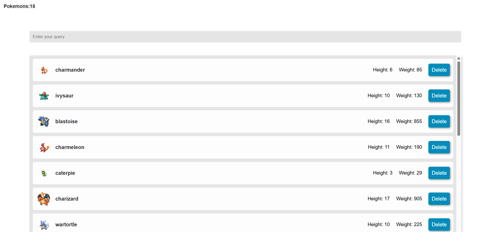

# Pokemon API Viewer

A small frontend project that fetches Pokemon data from an API, displays it in a table and allows users to manage selected Pokemon with `localStorage`.

This project was created as a learning project to practice JavaScript, working with API data, DOM manipulation and basic client-side storage.



## Live Demo

[Open the project](https://mar4enkop.github.io/pokemon-api-viewer/)

## Technologies


## Features

- Fetches Pokemon data from an external API
- Displays Pokemon information in a table
- Shows basic Pokemon data such as name, height and weight
- Saves selected Pokemon in `localStorage`
- Allows users to delete Pokémon from the saved list
- Uses JavaScript for dynamic rendering and user interaction

## What I Learned

- How to fetch data from an API
- How to work with JSON data
- How to render data dynamically with JavaScript
- How to use `localStorage`
- How to update the DOM based on user actions
- How to structure a small frontend project

## Project Structure

```text
pokemon-api-viewer/
├── css/
│   └── index.css
├── img/
│   └── preview.png
├── js/
│   └── index.js
├── .gitignore
├── index.html
└── README.md